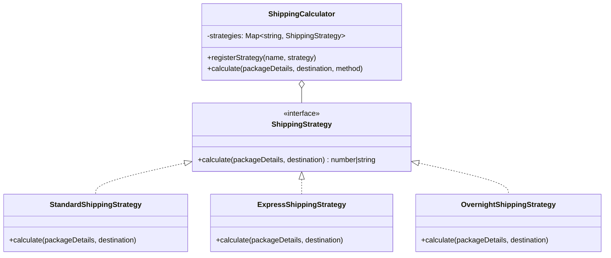

# Exercise Eleven: Design Pattern Implementation Challenge Submission

## Overview
This document represents the complete submission for **Exercise 11 - Design Pattern Implementation Challenge**, refactoring a JavaScript shipping cost calculator ([`shipping_cost.js`](file:///c:/Users/Admin/OneDrive/Desktop/ai-code-exercises-main/use-cases/refactor-patterns/javascript/shipping_cost.js)) using the **Strategy Pattern** to eliminate nested conditional ladders, uphold the Open/Closed Principle (OCP), and address all exercise reflection questions.

---

## 1. Selected Pattern Opportunity: Strategy Pattern (JavaScript)

**Source File**: [`use-cases/refactor-patterns/javascript/shipping_cost.js`](file:///c:/Users/Admin/OneDrive/Desktop/ai-code-exercises-main/use-cases/refactor-patterns/javascript/shipping_cost.js)

### Original Monolithic Code
```javascript
function calculateShippingCost(packageDetails, destinationCountry, shippingMethod) {
  const { weight, length, width, height } = packageDetails;
  let cost = 0;

  if (shippingMethod === 'standard') {
    if (destinationCountry === 'USA') cost = weight * 2.5;
    else if (destinationCountry === 'Canada') cost = weight * 3.5;
    else if (destinationCountry === 'Mexico') cost = weight * 4.0;
    else cost = weight * 4.5;

    if (weight < 2 && (length * width * height) > 1000) cost += 5.0;

  } else if (shippingMethod === 'express') {
    if (destinationCountry === 'USA') cost = weight * 4.5;
    else if (destinationCountry === 'Canada') cost = weight * 5.5;
    else if (destinationCountry === 'Mexico') cost = weight * 6.0;
    else cost = weight * 7.5;

    if ((length * width * height) > 5000) cost += 15.0;

  } else if (shippingMethod === 'overnight') {
    if (destinationCountry === 'USA') cost = weight * 9.5;
    else if (destinationCountry === 'Canada') cost = weight * 12.5;
    else return "Overnight shipping not available for this destination";
  }

  return cost.toFixed(2);
}
```

---

## 2. Pattern Analysis & Architectural Design



### Architectural Benefits:
1. **Open/Closed Principle (OCP)**: New shipping methods (e.g. `SameDayShippingStrategy`, `DroneShippingStrategy`) can be added by registering a new strategy class without editing existing calculator code.
2. **Single Responsibility Principle (SRP)**: Each strategy class encapsulates pricing multipliers and dimensional surcharge logic for a single shipping tier.
3. **Elimination of Conditional Coupling**: Replaces multi-branch `if/else if/else` statements with dictionary strategy lookup.

---

## 3. Refactored Strategy Pattern Implementation

```javascript
/**
 * Common Strategy Interface Definition:
 * Each strategy implements `calculate(packageDetails, destinationCountry)`
 */

// 1. Standard Shipping Strategy
class StandardShippingStrategy {
  calculate(packageDetails, destinationCountry) {
    const { weight, length, width, height } = packageDetails;

    const rateMap = {
      USA: 2.5,
      Canada: 3.5,
      Mexico: 4.0
    };
    const rate = rateMap[destinationCountry] || 4.5; // Default international
    let cost = weight * rate;

    // Dimensional weight surcharge for standard shipping
    const volume = length * width * height;
    if (weight < 2 && volume > 1000) {
      cost += 5.0;
    }

    return cost;
  }
}

// 2. Express Shipping Strategy
class ExpressShippingStrategy {
  calculate(packageDetails, destinationCountry) {
    const { weight, length, width, height } = packageDetails;

    const rateMap = {
      USA: 4.5,
      Canada: 5.5,
      Mexico: 6.0
    };
    const rate = rateMap[destinationCountry] || 7.5; // Default international
    let cost = weight * rate;

    // Large package surcharge for express shipping
    const volume = length * width * height;
    if (volume > 5000) {
      cost += 15.0;
    }

    return cost;
  }
}

// 3. Overnight Shipping Strategy
class OvernightShippingStrategy {
  calculate(packageDetails, destinationCountry) {
    const { weight } = packageDetails;

    const rateMap = {
      USA: 9.5,
      Canada: 12.5
    };

    if (!(destinationCountry in rateMap)) {
      return "Overnight shipping not available for this destination";
    }

    return weight * rateMap[destinationCountry];
  }
}

// 4. Strategy Context & Registry Manager
class ShippingCalculator {
  constructor() {
    this.strategies = new Map();
    
    // Register default built-in strategies
    this.registerStrategy('standard', new StandardShippingStrategy());
    this.registerStrategy('express', new ExpressShippingStrategy());
    this.registerStrategy('overnight', new OvernightShippingStrategy());
  }

  registerStrategy(methodName, strategy) {
    this.strategies.set(methodName.toLowerCase(), strategy);
  }

  calculate(packageDetails, destinationCountry, shippingMethod) {
    const strategy = this.strategies.get(shippingMethod.toLowerCase());

    if (!strategy) {
      throw new Error(`Unsupported shipping method: ${shippingMethod}`);
    }

    const result = strategy.calculate(packageDetails, destinationCountry);

    // If strategy returns an error string, return it directly
    if (typeof result === 'string') {
      return result;
    }

    return result.toFixed(2);
  }
}

// Global instance for backward compatibility
const defaultCalculator = new ShippingCalculator();

/**
 * Backward-compatible wrapper function maintaining original API signature
 */
function calculateShippingCost(packageDetails, destinationCountry, shippingMethod) {
  return defaultCalculator.calculate(packageDetails, destinationCountry, shippingMethod);
}

module.exports = {
  calculateShippingCost,
  ShippingCalculator,
  StandardShippingStrategy,
  ExpressShippingStrategy,
  OvernightShippingStrategy
};
```

---

## 4. Verification & Unit Tests

```javascript
describe('Strategy Pattern Shipping Calculator Verification', () => {
  const pkg = { weight: 5, length: 10, width: 10, height: 10 }; // Volume = 1000

  test('calculates standard shipping cost for USA correctly', () => {
    expect(calculateShippingCost(pkg, 'USA', 'standard')).toBe("12.50");
  });

  test('calculates express shipping cost for Canada correctly', () => {
    expect(calculateShippingCost(pkg, 'Canada', 'express')).toBe("27.50");
  });

  test('returns error message for unsupported overnight destinations', () => {
    expect(calculateShippingCost(pkg, 'Mexico', 'overnight'))
      .toBe("Overnight shipping not available for this destination");
  });

  test('applies dimensional weight surcharge for light bulky standard packages', () => {
    const lightBulkyPkg = { weight: 1, length: 20, width: 10, height: 10 }; // Volume = 2000
    // Base: 1 * 2.5 = 2.5 + 5.0 surcharge = 7.50
    expect(calculateShippingCost(lightBulkyPkg, 'USA', 'standard')).toBe("7.50");
  });

  test('allows registering custom strategies dynamically (Extensibility)', () => {
    const calculator = new ShippingCalculator();
    
    // Register new custom Same-Day strategy
    calculator.registerStrategy('sameday', {
      calculate: (pkg) => pkg.weight * 20.0
    });

    expect(calculator.calculate(pkg, 'USA', 'sameday')).toBe("100.00");
  });
});
```

---

## 5. Reflections & Answers to Questions

### 1. How did implementing the pattern improve the code's maintainability?
* **Decoupled Pricing Logic**: Modifying standard shipping surcharge rules only touches `StandardShippingStrategy`, isolating risk from `express` or `overnight` logic.
* **Readable Strategy Declarations**: Each class is under 25 lines of code, making pricing rules self-contained and easily readable.

### 2. What future changes will be easier because of this pattern?
* **Adding New Tiers**: Adding a new tier (e.g., `drone`, `freight`, or `eco`) requires zero modifications to existing classes. Developers simply instantiate a new strategy object and register it with `calculator.registerStrategy()`.
* **A/B Testing & Dynamic Pricing**: Rates can be swapped dynamically at runtime based on user tier or promotion flags.

### 3. Were there any unexpected challenges in implementing the pattern?
* **Handling Non-Numeric Return Invariants**: `OvernightShippingStrategy` returns an error string (`"Overnight shipping not available..."`) instead of a number. The context runner had to type-check `typeof result === 'string'` before calling `.toFixed(2)`.
