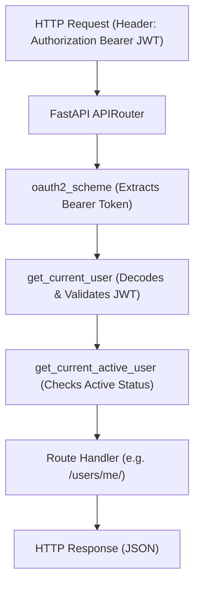

# Exercise Fifteen: Contextual Learning with FastAPI Submission

## Overview
This document represents the complete submission for **Exercise 15 - Contextual Learning with FastAPI**, mapping existing web framework mental models (Flask/Express/Django) to FastAPI, examining core architectural design choices (Pydantic, Type Hints, ASGI, Dependency Injection), implementing a full OAuth2 JWT Authentication workflow, and providing conceptual translation diagrams.

---

## Part 1: Framework Comparison & Concept Translation Table

### Framework Concept Translation Matrix

| Concept | Flask (Python) | Express.js (JavaScript) | Django (Python) | FastAPI Equivalent |
| :--- | :--- | :--- | :--- | :--- |
| **Routing / Modularization** | `Blueprint` | `express.Router()` | `urls.py` include | `APIRouter(prefix=...)` |
| **Request Data Validation** | Marshmallow / Manual `request.json` | Express Validator / Zod | `forms.Form` / `serializers.ModelSerializer` | **Pydantic Schemas** (`BaseModel`) |
| **Route Guards / Auth** | Decorators (`@login_required`) | Middleware (`req, res, next`) | Middleware / Mixins | **Dependency Injection** (`Depends(get_current_user)`) |
| **API Documentation** | Manual Swagger / Flasgger | Swagger UI Express | Django REST Framework Swagger | **Automatic Built-in OpenAPI** (`/docs` & `/redoc`) |
| **Web Server** | Gunicorn (WSGI) | Node.js Event Loop | Gunicorn / WSGI | **Uvicorn / Hypercorn** (ASGI) |

---

## Part 2: Understanding FastAPI's Core Design Choices

### 1. Why Pydantic for Data Validation?
Instead of creating a proprietary validator, FastAPI leveraged Pydantic. Because Pydantic uses standard Python type annotations, developers don't have to learn a separate schema definition language. Pydantic parses JSON data into validated Python object instances at runtime and automatically emits OpenAPI JSON schemas.

### 2. Why Extensive Type Hinting?
Type hints serve a dual purpose in FastAPI:
* **Developer Ergonomics**: IDE autocompletion, static type checking via Pyright/mypy.
* **Runtime Execution Contract**: FastAPI uses type hints to parse path params, query params, request headers, and JSON bodies without boilerplate manual parsing code.

### 3. Why Async-First (ASGI)?
Flask and Django traditionally operate on a synchronous WSGI thread-per-request model, blocking OS threads during I/O operations (database queries, HTTP calls). FastAPI uses **ASGI (Starlette)**, permitting single-process async event loops (`async def`) capable of handling thousands of concurrent connections per second (on par with Node.js and Go).

---

## Part 3: Applied Implementation - JWT Authentication in FastAPI

Below is the complete JWT authentication implementation using OAuth2 password flow, `passlib` bcrypt password hashing, and `python-jose` token generation:

```python
"""
FastAPI Production OAuth2 JWT Authentication Application
"""

from datetime import datetime, timedelta
from typing import Optional, Dict

from fastapi import Depends, FastAPI, HTTPException, status
from fastapi.security import OAuth2PasswordBearer, OAuth2PasswordRequestForm
from jose import JWTError, jwt
from passlib.context import CryptContext
from pydantic import BaseModel, EmailStr

# ==========================================
# 1. SECURITY CONFIGURATIONS & CONSTANTS
# ==========================================

SECRET_KEY = "9a8f7b6c5d4e3f2a1b0c9d8e7f6a5b4c3d2e1f0a"  # In production, load via environment variables
ALGORITHM = "HS256"
ACCESS_TOKEN_EXPIRE_MINUTES = 30

pwd_context = CryptContext(schemes=["bcrypt"], deprecated="auto")
oauth2_scheme = OAuth2PasswordBearer(tokenUrl="token")

# Simulated User Store (Hashed password for plain "secret")
fake_users_db: Dict[str, Dict] = {
    "johndoe": {
        "username": "johndoe",
        "full_name": "John Doe",
        "email": "johndoe@example.com",
        "hashed_password": "$2b$12$EixZaYVK1fsbw1ZfbX3OXePaWxn96p36WQoeG6Lruj3vjPGga31lW",
        "disabled": False,
    }
}

# ==========================================
# 2. PYDANTIC SCHEMAS
# ==========================================

class Token(BaseModel):
    access_token: str
    token_type: str

class TokenData(BaseModel):
    username: Optional[str] = None

class User(BaseModel):
    username: str
    email: Optional[EmailStr] = None
    full_name: Optional[str] = None
    disabled: Optional[bool] = None

class UserInDB(User):
    hashed_password: str

# ==========================================
# 3. HELPER FUNCTIONS
# ==========================================

def verify_password(plain_password: str, hashed_password: str) -> bool:
    return pwd_context.verify(plain_password, hashed_password)

def get_password_hash(password: str) -> str:
    return pwd_context.hash(password)

def get_user(db: Dict, username: str) -> Optional[UserInDB]:
    if username in db:
        return UserInDB(**db[username])
    return None

def authenticate_user(db: Dict, username: str, password: str) -> Optional[UserInDB]:
    user = get_user(db, username)
    if not user or not verify_password(password, user.hashed_password):
        return None
    return user

def create_access_token(data: dict, expires_delta: Optional[timedelta] = None) -> str:
    to_encode = data.copy()
    expire = datetime.utcnow() + (expires_delta if expires_delta else timedelta(minutes=15))
    to_encode.update({"exp": expire})
    return jwt.encode(to_encode, SECRET_KEY, algorithm=ALGORITHM)

# ==========================================
# 4. DEPENDENCY INJECTION GUARDS
# ==========================================

async def get_current_user(token: str = Depends(oauth2_scheme)) -> UserInDB:
    credentials_exception = HTTPException(
        status_code=status.HTTP_401_UNAUTHORIZED,
        detail="Could not validate credentials",
        headers={"WWW-Authenticate": "Bearer"},
    )
    try:
        payload = jwt.decode(token, SECRET_KEY, algorithms=[ALGORITHM])
        username: str = payload.get("sub")
        if username is None:
            raise credentials_exception
        token_data = TokenData(username=username)
    except JWTError:
        raise credentials_exception

    user = get_user(fake_users_db, username=token_data.username)
    if user is None:
        raise credentials_exception
    return user

async def get_current_active_user(current_user: UserInDB = Depends(get_current_user)) -> User:
    if current_user.disabled:
        raise HTTPException(status_code=status.HTTP_400_BAD_REQUEST, detail="Inactive user account")
    return current_user

# ==========================================
# 5. APPLICATION & ROUTES
# ==========================================

app = FastAPI(title="FastAPI OAuth2 JWT Auth System", version="1.0.0")

@app.post("/token", response_model=Token, tags=["auth"])
async def login_for_access_token(form_data: OAuth2PasswordRequestForm = Depends()):
    """Generates JWT Access Token for valid username & password."""
    user = authenticate_user(fake_users_db, form_data.username, form_data.password)
    if not user:
        raise HTTPException(
            status_code=status.HTTP_401_UNAUTHORIZED,
            detail="Incorrect username or password",
            headers={"WWW-Authenticate": "Bearer"},
        )
    access_token_expires = timedelta(minutes=ACCESS_TOKEN_EXPIRE_MINUTES)
    access_token = create_access_token(
        data={"sub": user.username}, expires_delta=access_token_expires
    )
    return {"access_token": access_token, "token_type": "bearer"}

@app.get("/users/me/", response_model=User, tags=["users"])
async def read_users_me(current_user: User = Depends(get_current_active_user)):
    """Protected endpoint: Returns current authenticated user profile."""
    return current_user

@app.get("/users/me/items/", tags=["items"])
async def read_own_items(current_user: User = Depends(get_current_active_user)):
    """Protected endpoint: Returns user items."""
    return [{"item_id": "Item_Alpha", "owner": current_user.username}]
```

---

## Part 4: Architectural Mental Model Translation



---

## Reflections & Answers to Part 3 Questions

### 1. How does FastAPI's authentication approach compare to other frameworks?
In Flask or Express, authentication is typically handled via global middleware chains or custom decorators that mutate global request objects (`g.user` or `req.user`). FastAPI handles authentication via **Dependency Injection (`Depends`)**, making dependencies explicit in the function signature without mutating global state.

### 2. What advantages does FastAPI's dependency injection system provide for authentication?
* **Composability**: Dependencies can depend on other dependencies (e.g., `get_current_active_user` depends on `get_current_user`).
* **Easy Testing**: In unit tests, dependencies can be overridden instantly using `app.dependency_overrides[get_current_user] = mock_user_func` without mocking HTTP headers or JWT libraries.

### 3. How does type hinting make security implementations clearer?
By annotating `current_user: User = Depends(...)`, IDEs immediately provide autocompletion for user properties (`current_user.username`, `current_user.email`), ensuring developer accuracy when enforcing permissions.
