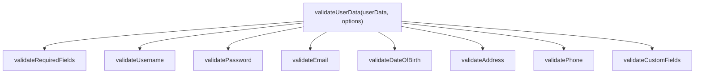

# Exercise Nine: Function Decomposition Challenge Submission

## Overview
This document represents the complete submission for **Exercise 9 - Function Decomposition Challenge**, analyzing and refactoring a complex JavaScript data validation function containing nested conditionals ([`validateUserData`](file:///c:/Users/Admin/OneDrive/Desktop/ai-code-exercises-main/use-cases/refactor-functions/javascript/user_validator.js)), decomposing it into single-responsibility validator modules, and answering all exercise reflection questions.

---

## 1. Selected Function: JavaScript `validateUserData`

**Source File**: [`use-cases/refactor-functions/javascript/user_validator.js`](file:///c:/Users/Admin/OneDrive/Desktop/ai-code-exercises-main/use-cases/refactor-functions/javascript/user_validator.js)

### Original Monolithic Code Analysis
The original `validateUserData` function spans **over 150 lines of code** and has a cyclomatic complexity exceeding 25. It performs 8 unrelated validation tasks inside nested `if/else` conditionals:
1. Required fields validation (registration vs profile mode)
2. Username length, regex, and database existence
3. Password complexity rules (length, uppercase, lowercase, numbers, special characters, confirmation match)
4. Email syntax and duplicate registration check
5. Date of Birth age bounds checking (13 to 120 years old)
6. Address object structure and country-specific postal code validation (US, CA, UK)
7. Phone number pattern validation
8. Custom rule execution

---

## 2. Decomposition Strategy & Architecture Plan



### Extracted Helper Modules & Responsibilities:
1. `validateRequiredFields(userData, isRegistration)`: Checks mandatory fields for registration or profile update.
2. `validateUsername(username, checkExisting)`: Validates length (3-20 chars), regex pattern `^[a-zA-Z0-9_]+$`, and availability.
3. `validatePassword(password, confirmPassword)`: Validates complexity rules and password match.
4. `validateEmail(email, isRegistration, checkExisting)`: Validates email formatting and duplicate registration.
5. `validateDateOfBirth(dateOfBirth)`: Validates valid date parsing and age boundaries (13-120 years).
6. `validateAddress(address)`: Validates required address keys and country-specific postal formats (US, CA, UK).
7. `validatePhone(phone)`: Validates international phone format regex.
8. `validateCustomFields(userData, customValidations)`: Executes user-supplied validator callbacks.

---

## 3. Fully Refactored Modular Code

```javascript
/**
 * Individual Validator Modules
 */

function validateRequiredFields(userData, isRegistration) {
  const errors = [];
  const requiredForRegistration = ['username', 'email', 'password', 'confirmPassword'];
  const requiredForProfile = ['firstName', 'lastName', 'dateOfBirth', 'address'];

  if (isRegistration) {
    for (const field of requiredForRegistration) {
      if (!userData[field] || userData[field].trim() === '') {
        errors.push(`${field} is required for registration`);
      }
    }
  } else {
    for (const field of requiredForProfile) {
      if (userData[field] !== undefined && userData[field].trim() === '') {
        errors.push(`${field} cannot be empty if provided`);
      }
    }
  }
  return errors;
}

function validateUsername(username, checkExisting = null) {
  const errors = [];
  if (!username) return errors;

  if (username.length < 3) {
    errors.push('Username must be at least 3 characters long');
  } else if (username.length > 20) {
    errors.push('Username must be at most 20 characters long');
  } else if (!/^[a-zA-Z0-9_]+$/.test(username)) {
    errors.push('Username can only contain letters, numbers, and underscores');
  } else if (checkExisting && checkExisting.usernameExists(username)) {
    errors.push('Username is already taken');
  }
  return errors;
}

function validatePassword(password, confirmPassword) {
  const errors = [];
  if (!password) return errors;

  if (password.length < 8) {
    errors.push('Password must be at least 8 characters long');
  } else if (!/[A-Z]/.test(password)) {
    errors.push('Password must contain at least one uppercase letter');
  } else if (!/[a-z]/.test(password)) {
    errors.push('Password must contain at least one lowercase letter');
  } else if (!/[0-9]/.test(password)) {
    errors.push('Password must contain at least one number');
  } else if (!/[^A-Za-z0-9]/.test(password)) {
    errors.push('Password must contain at least one special character');
  }

  if (confirmPassword !== password) {
    errors.push('Password and confirmation do not match');
  }
  return errors;
}

function validateEmail(email, isRegistration, checkExisting = null) {
  const errors = [];
  if (email === undefined) return errors;

  const trimmed = email.trim();
  if (trimmed === '') {
    if (isRegistration) errors.push('Email is required');
    return errors;
  }

  const emailRegex = /^[^\s@]+@[^\s@]+\.[^\s@]+$/;
  if (!emailRegex.test(trimmed)) {
    errors.push('Email format is invalid');
  } else if (checkExisting && checkExisting.emailExists(trimmed)) {
    errors.push('Email is already registered');
  }
  return errors;
}

function validateDateOfBirth(dateOfBirth) {
  const errors = [];
  if (!dateOfBirth) return errors;

  const dobDate = new Date(dateOfBirth);
  if (isNaN(dobDate.getTime())) {
    errors.push('Date of birth is not a valid date');
    return errors;
  }

  const now = new Date();
  const minAgeDate = new Date(now.getFullYear() - 13, now.getMonth(), now.getDate());
  const maxAgeDate = new Date(now.getFullYear() - 120, now.getMonth(), now.getDate());

  if (dobDate > now) {
    errors.push('Date of birth cannot be in the future');
  } else if (dobDate > minAgeDate) {
    errors.push('You must be at least 13 years old');
  } else if (dobDate < maxAgeDate) {
    errors.push('Invalid date of birth (age > 120 years)');
  }
  return errors;
}

function validatePostalCode(zip, country) {
  const patterns = {
    US: /^\d{5}(-\d{4})?$/,
    CA: /^[A-Za-z]\d[A-Za-z] \d[A-Za-z]\d$/,
    UK: /^[A-Z]{1,2}\d[A-Z\d]? \d[A-Z]{2}$/
  };

  if (patterns[country] && !patterns[country].test(zip)) {
    const labels = { US: 'US ZIP code', CA: 'Canadian postal code', UK: 'UK postal code' };
    return `Invalid ${labels[country]} format`;
  }
  return null;
}

function validateAddress(address) {
  const errors = [];
  if (address === undefined || address === '') return errors;

  if (typeof address !== 'object' || address === null) {
    errors.push('Address must be an object with required fields');
    return errors;
  }

  const requiredAddressFields = ['street', 'city', 'zip', 'country'];
  for (const field of requiredAddressFields) {
    if (!address[field] || address[field].trim() === '') {
      errors.push(`Address ${field} is required`);
    }
  }

  if (address.zip && address.country) {
    const postalError = validatePostalCode(address.zip, address.country);
    if (postalError) errors.push(postalError);
  }
  return errors;
}

function validatePhone(phone) {
  const errors = [];
  if (!phone) return errors;

  if (!/^\+?[\d\s\-()]{10,15}$/.test(phone)) {
    errors.push('Phone number format is invalid');
  }
  return errors;
}

function validateCustomFields(userData, customValidations = []) {
  const errors = [];
  for (const validation of customValidations) {
    const field = validation.field;
    if (userData[field] !== undefined) {
      if (!validation.validator(userData[field], userData)) {
        errors.push(validation.message || `Invalid value for ${field}`);
      }
    }
  }
  return errors;
}

/**
 * Main Orchestrator Function
 */
function validateUserData(userData, options = {}) {
  const isRegistration = options.isRegistration || false;

  const errors = [
    ...validateRequiredFields(userData, isRegistration),
    ...(isRegistration ? validateUsername(userData.username, options.checkExisting) : []),
    ...(isRegistration ? validatePassword(userData.password, userData.confirmPassword) : []),
    ...validateEmail(userData.email, isRegistration, options.checkExisting),
    ...validateDateOfBirth(userData.dateOfBirth),
    ...validateAddress(userData.address),
    ...validatePhone(userData.phone),
    ...validateCustomFields(userData, options.customValidations)
  ];

  return errors;
}

module.exports = {
  validateUserData,
  validateUsername,
  validatePassword,
  validateEmail,
  validateDateOfBirth,
  validateAddress,
  validatePhone
};
```

---

## 4. Reflections & Key Learnings

### 1. How did breaking down the function improve readability and maintainability?
* **Cyclomatic Complexity Reduction**: Decreased cyclomatic complexity from $>25$ in a single 150-line file down to clean $<3$ complexity per helper function.
* **Declarative Pipeline**: The main `validateUserData` function is now a 15-line orchestrator array spread (`[...validateEmail(...), ...validateAddress(...)]`) that reads like a clear checklist.
* **Isolated Testing**: Individual rules (e.g. `validatePostalCode('90210', 'US')`) can now be unit-tested directly in isolation without constructing massive `userData` objects.

### 2. What was the most challenging part of decomposing the function?
* **Managing Dependent State**: Safely handling `options.isRegistration` vs profile update mode across required fields and email validation while maintaining exact backwards-compatible error message string outputs.

### 3. Which extracted function would be most reusable in other contexts?
* **`validateEmail`** and **`validatePassword`**: These functions are completely independent of the `userData` structure and can be reused directly in authentication controllers, API route middleware, or front-end form validation modules across the codebase.
