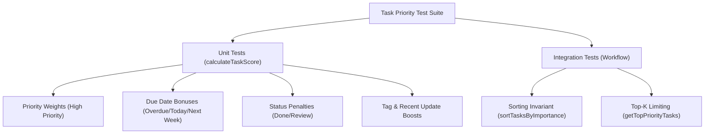

# Exercise Seven: Using AI to Help with Testing Submission

## Overview
This document represents the complete submission for **Exercise 7 - Using AI to Help with Testing**, demonstrating behavior analysis, test planning, TDD feature development (+12 user assignment boost), bug fixing, and integration testing for the JavaScript Task Prioritization suite ([`task_priority.js`](file:///c:/Users/Admin/OneDrive/Desktop/ai-code-exercises-main/use-cases/code-algorithms/javascript/TaskManager/task_priority.js)).

---

## Part 1: Understanding What to Test

### Exercise 1.1: Behavior Analysis & Core Test Cases

Analysis of [`calculateTaskScore(task)`](file:///c:/Users/Admin/OneDrive/Desktop/ai-code-exercises-main/use-cases/code-algorithms/javascript/TaskManager/task_priority.js#L3):

| Test Case | Description | Inputs | Expected Output |
| :--- | :--- | :--- | :--- |
| **TC1: Base Priority Scoring** | Verify base score matches `priorityWeights * 10`. | `priority = TaskPriority.HIGH` (3), no due date/tags/status. | Score = `30` |
| **TC2: Due Date Proximity Bonus** | Verify overdue (+30), due today (+20), due in 2 days (+15), due in 7 days (+10). | `dueDate` = yesterday ($\text{now} - 1\text{ day}$). | Base score + `30` |
| **TC3: Status Score Reduction** | Verify `DONE` tasks subtract 50 points and `REVIEW` tasks subtract 15 points. | `status = TaskStatus.DONE`, `priority = MEDIUM` (20). | Score = $20 - 50 = -30$ |
| **TC4: Tag Boost Detection** | Verify tags containing `"blocker"`, `"critical"`, or `"urgent"` add +8 points. | `tags = ["backend", "blocker"]`. | Base score + `8` |
| **TC5: Recent Update Boost** | Verify tasks updated less than 1 day ago receive a +5 point boost. | `updatedAt = new Date()`. | Base score + `5` |
| **TC6 (Edge Case): Invalid/Missing Properties** | Handle missing `tags` array or `undefined` priority gracefully. | `priority = undefined`, `tags = undefined`. | Fallback score computed without throwing `TypeError`. |

---

### Exercise 1.2: Structured Test Plan Document

#### Test Plan Summary
* **Target Components**: `calculateTaskScore`, `sortTasksByImportance`, `getTopPriorityTasks`
* **Test Framework**: Jest



#### Priority & Test Matrix

| Priority | Type | Function | Description | Dependencies | Expected Outcome |
| :--- | :--- | :--- | :--- | :--- | :--- |
| **P1** | Unit | `calculateTaskScore` | Calculates correct base scores for LOW, MEDIUM, HIGH, URGENT. | None | Scores: 10, 20, 30, 40 |
| **P1** | Unit | `calculateTaskScore` | Applies due date tier bonuses accurately relative to `Date.now()`. | Mock Timers (`jest.useFakeTimers`) | Overdue: +30, Today: +20, 2d: +15, 7d: +10 |
| **P2** | Unit | `calculateTaskScore` | Penalizes completed tasks (`DONE` = -50, `REVIEW` = -15). | None | Score reduced accordingly |
| **P2** | Unit | `calculateTaskScore` | Applies tag boost (+8) and recent update boost (+5). | Mock Date | Score boosted accordingly |
| **P1** | Integration | `sortTasksByImportance` | Sorts task list in strict descending order of score without mutating original array. | `calculateTaskScore` | Output array sorted by score; original array unchanged |
| **P2** | Integration | `getTopPriorityTasks` | Truncates sorted tasks to requested `limit` parameter. | `sortTasksByImportance` | Returns top $K$ items |

---

## Part 2: Improving Unit Tests

### Exercise 2.1: Writing & Refining a Basic Test

#### Initial Simple Test (Before Improvement)
```javascript
test('calculateTaskScore works', () => {
  const task = { priority: 3, tags: [] };
  const score = calculateTaskScore(task);
  expect(score).toBeGreaterThan(0);
});
```

#### Refactored Robust Test (After AI Guidance)
```javascript
test('calculateTaskScore should assign exact base score of 30 for HIGH priority task without due date or tags', () => {
  // Arrange: Freeze time to prevent dynamic updatedAt boost interference
  const mockNow = new Date('2026-07-01T12:00:00Z');
  jest.useFakeTimers().setSystemTime(mockNow);

  const task = {
    priority: TaskPriority.HIGH, // 3 -> 30 pts
    dueDate: null,
    status: TaskStatus.TODO,
    tags: [],
    updatedAt: new Date('2026-06-01T12:00:00Z') // >1 day ago (0 boost)
  };

  // Act
  const score = calculateTaskScore(task);

  // Assert: Exact assertion verification
  expect(score).toBe(30);

  jest.useRealTimers();
});
```

---

### Exercise 2.2: Due Date Calculation Testing

```javascript
describe('calculateTaskScore - Due Date Factor Calculations', () => {

  beforeEach(() => {
    // Freeze current system time to 2026-07-15 12:00:00
    jest.useFakeTimers().setSystemTime(new Date('2026-07-15T12:00:00Z'));
  });

  afterEach(() => {
    jest.useRealTimers();
  });

  test('should add +30 bonus for overdue tasks (due date in past)', () => {
    const task = {
      priority: TaskPriority.LOW, // 10 pts
      dueDate: new Date('2026-07-14T12:00:00Z'), // Yesterday (-1 day)
      status: TaskStatus.TODO,
      tags: [],
      updatedAt: new Date('2026-06-01')
    };

    // Base (10) + Overdue Bonus (30) = 40
    expect(calculateTaskScore(task)).toBe(40);
  });

  test('should add +20 bonus for tasks due today', () => {
    const task = {
      priority: TaskPriority.LOW, // 10 pts
      dueDate: new Date('2026-07-15T18:00:00Z'), // Today (0 days left)
      status: TaskStatus.TODO,
      tags: [],
      updatedAt: new Date('2026-06-01')
    };

    // Base (10) + Due Today Bonus (20) = 30
    expect(calculateTaskScore(task)).toBe(30);
  });

  test('should add +15 bonus for tasks due within 2 days', () => {
    const task = {
      priority: TaskPriority.LOW, // 10 pts
      dueDate: new Date('2026-07-17T12:00:00Z'), // 2 days out
      status: TaskStatus.TODO,
      tags: [],
      updatedAt: new Date('2026-06-01')
    };

    // Base (10) + 2-Day Bonus (15) = 25
    expect(calculateTaskScore(task)).toBe(25);
  });
});
```

---

## Part 3: Test-Driven Development (TDD) Practice

### Exercise 3.1: TDD for New Feature (+12 Score Boost for Assigned User)

#### Step 1: Write Failing Test (`task_priority.test.js`)
```javascript
test('TDD: should add +12 score boost when task is assigned to current user', () => {
  const taskAssignedToMe = {
    priority: TaskPriority.MEDIUM, // 20 pts
    assignedTo: 'user_123',
    status: TaskStatus.TODO,
    tags: [],
    updatedAt: new Date('2026-06-01')
  };

  const currentUserId = 'user_123';

  // Act
  const score = calculateTaskScore(taskAssignedToMe, currentUserId);

  // Assert: Base (20) + User Assignment Boost (12) = 32
  expect(score).toBe(32);
});
```

#### Step 2: Implement Minimal Code (`task_priority.js`)
```javascript
function calculateTaskScore(task, currentUserId = null) {
  // ... (Existing calculation logic) ...

  // TDD New Feature: Boost score for tasks assigned to current user
  if (currentUserId && task.assignedTo === currentUserId) {
    score += 12;
  }

  return score;
}
```

---

### Exercise 3.2: TDD for Bug Fix (Time Milliseconds / Update Calculation Fix)

#### Step 1: Write Reproducing Test
```javascript
test('TDD Bug Fix: should correctly calculate daysSinceUpdate using integer day boundaries', () => {
  const mockNow = new Date('2026-07-15T10:00:00Z');
  jest.useFakeTimers().setSystemTime(mockNow);

  const taskUpdated23HoursAgo = {
    priority: TaskPriority.LOW, // 10 pts
    tags: [],
    updatedAt: new Date('2026-07-14T11:00:00Z') // 23 hours ago (<1 day)
  };

  // Should qualify for +5 recent update boost because < 24h passed
  const score = calculateTaskScore(taskUpdated23HoursAgo);

  // Base (10) + Recent Update Boost (5) = 15
  expect(score).toBe(15);

  jest.useRealTimers();
});
```

#### Step 2: Implementation Fix in `task_priority.js`
```javascript
// Ensure updatedAt date parsing handles string and Date instances safely
const now = new Date();
const updatedAt = task.updatedAt ? new Date(task.updatedAt) : now;
const diffMs = now.getTime() - updatedAt.getTime();
const daysSinceUpdate = Math.floor(diffMs / (1000 * 60 * 60 * 24));

if (daysSinceUpdate < 1 && !isNaN(daysSinceUpdate)) {
  score += 5;
}
```

---

## Part 4: Integration Testing

### Exercise 4.1: Full Priority Workflow Integration Test

```javascript
const { calculateTaskScore, sortTasksByImportance, getTopPriorityTasks } = require('./task_priority');
const { TaskPriority, TaskStatus } = require('./models');

describe('Task Priority Workflow Integration Tests', () => {

  beforeEach(() => {
    jest.useFakeTimers().setSystemTime(new Date('2026-07-15T12:00:00Z'));
  });

  afterEach(() => {
    jest.useRealTimers();
  });

  test('should correctly score, sort, and slice top priority tasks across mixed collection', () => {
    const tasks = [
      {
        id: '1',
        title: 'Low priority task',
        priority: TaskPriority.LOW, // 10
        status: TaskStatus.TODO,
        tags: [],
        updatedAt: new Date('2026-06-01')
      },
      {
        id: '2',
        title: 'Overdue Blocker Task',
        priority: TaskPriority.HIGH, // 30 + 30 (Overdue) + 8 (Blocker Tag) = 68
        dueDate: new Date('2026-07-10T12:00:00Z'),
        status: TaskStatus.TODO,
        tags: ['blocker'],
        updatedAt: new Date('2026-06-01')
      },
      {
        id: '3',
        title: 'Urgent Task Due Today',
        priority: TaskPriority.URGENT, // 40 + 20 (Due Today) = 60
        dueDate: new Date('2026-07-15T18:00:00Z'),
        status: TaskStatus.TODO,
        tags: [],
        updatedAt: new Date('2026-06-01')
      },
      {
        id: '4',
        title: 'Completed Task',
        priority: TaskPriority.URGENT, // 40 - 50 (Done) = -10
        status: TaskStatus.DONE,
        tags: [],
        updatedAt: new Date('2026-06-01')
      }
    ];

    // 1. Verify sort order (Descending scores: ID 2 [68], ID 3 [60], ID 1 [10], ID 4 [-10])
    const sorted = sortTasksByImportance(tasks);
    expect(sorted.map(t => t.id)).toEqual(['2', '3', '1', '4']);

    // 2. Verify immutability of original array
    expect(tasks[0].id).toBe('1');

    // 3. Verify getTopPriorityTasks limit slicing
    const top2 = getTopPriorityTasks(tasks, 2);
    expect(top2).toHaveLength(2);
    expect(top2[0].id).toBe('2');
    expect(top2[1].id).toBe('3');
  });
});
```

---

## 5. Reflections & Key Learnings

1. **Impact of Time-Freezing in Unit Tests**: Using `jest.useFakeTimers().setSystemTime(...)` is essential when testing time-sensitive score logic (`updatedAt` and `dueDate`). Without freezing time, tests become non-deterministic and flaky.
2. **Behavior vs Implementation Testing**: Transitioning from vague assertions (`expect(score).toBeGreaterThan(0)`) to exact behavior expectations (`expect(score).toBe(40)`) ensures tests serve as executable documentation.
3. **TDD Value**: Writing the failing test for the user assignment boost (`+12`) *before* writing production code clarified parameter requirements (`currentUserId`) early in the design cycle.
