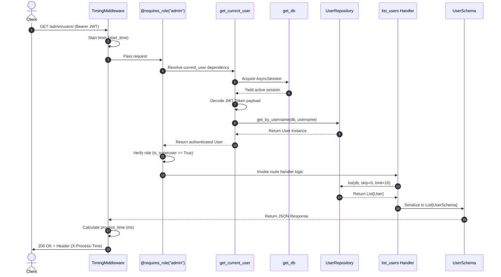

# Exercise Seventeen: Understanding FastAPI Code Patterns Submission

## Overview
This document represents the complete submission for **Exercise 17 - Understanding FastAPI Code Patterns**, analyzing advanced architectural patterns (Generic Repository, Service Layer, Custom Middleware, Role-Based Decorators, Async Lifespans), tracing end-to-end request execution flows, simplifying complex concepts, and extending the codebase with an Audit Logging System following the repository pattern.

---

## Part 1: Pattern Breakdown & Code Analysis

### 1. Generic Repository Pattern (`Generic[T]`)
* **Purpose**: Decouples database interaction logic from business services. `Repository[T]` abstracts basic CRUD (`get_by_id`, `list`) for any SQLAlchemy model `T`.
* **Why use it**: Prevents code duplication across entities and allows switching or mocking database layers in unit tests without touching service logic.

### 2. Service Layer (`UserService`)
* **Purpose**: Encapsulates business domain operations (user authentication, password verification, JWT generation).
* **Why use it**: Keeps route handlers slim by delegating business decisions to reusable service classes.

### 3. Role-Based Access Control (`@requires_role("admin")`)
* **Purpose**: A custom decorator wrapping route handlers to enforce authorization guards (e.g. checking `current_user.is_superuser`).

### 4. Application Lifespan (`@asynccontextmanager`)
* **Purpose**: Replaces deprecated startup/shutdown event handlers with a clean Python context manager (`yield`).

---

## Part 2: Request Execution Flow (`GET /admin/users/`)



---

## Part 3: Translation Guide for Junior Developers

### 1. `Generic[T]` Repository Pattern
> **Plain English**: Think of `Repository[T]` as a universal cookie cutter for database operations. Instead of writing custom code to fetch a User, an Order, or a Product, the Generic Repository provides a reusable set of database methods for any data model.

### 2. `TimingMiddleware`
> **Plain English**: A security checkpoint or stopwatch that sits at the front door of your web app. It starts a clock when a request arrives, lets the app process the request, stops the clock when done, and attaches the elapsed time to the response headers (`X-Process-Time`).

### 3. Application Lifespan (`lifespan`)
> **Plain English**: The setup and teardown instructions for your server. Anything before `yield` runs when the server powers ON (connecting to database pools), and anything after `yield` runs when the server powers OFF (closing connections).

---

## Part 4: Implementation Extension - Audit Logging System

Below is the complete implementation extending the exercise codebase with an Audit Logging system using the identical Generic Repository, Dependency Injection, and Service patterns:

```python
"""
Audit Logging Feature Extension for Exercise 17 Codebase
Follows Generic Repository, Service Layer, and FastAPI Dependency Patterns
"""

from datetime import datetime
from typing import Optional, List
from fastapi import FastAPI, Depends, HTTPException, status, Request, Response
from sqlalchemy import Column, Integer, String, DateTime, ForeignKey
from sqlalchemy.ext.asyncio import AsyncSession
from sqlalchemy.future import select
from pydantic import BaseModel
from typing import TypeVar, Generic, Type

# ==========================================
# 1. DATABASE MODEL & REPOSITORY SPECIALIZATION
# ==========================================

class AuditLog(Base):
    __tablename__ = "audit_logs"
    id = Column(Integer, primary_key=True, index=True)
    user_id = Column(Integer, ForeignKey("users.id"), nullable=False)
    username = Column(String, nullable=False)
    action = Column(String, nullable=False)
    resource = Column(String, nullable=False)
    timestamp = Column(DateTime, default=datetime.utcnow)

class AuditLogRepository(Repository[AuditLog]):
    async def get_logs_by_user(self, db: AsyncSession, user_id: int) -> List[AuditLog]:
        result = await db.execute(
            select(AuditLog).where(AuditLog.user_id == user_id).order_by(AuditLog.timestamp.desc())
        )
        return result.scalars().all()

# ==========================================
# 2. SERVICE LAYER
# ==========================================

class AuditLogService:
    def __init__(self, repository: AuditLogRepository):
        self.repository = repository

    async def log_action(
        self, db: AsyncSession, user_id: int, username: str, action: str, resource: str
    ) -> AuditLog:
        log_entry = AuditLog(
            user_id=user_id,
            username=username,
            action=action,
            resource=resource,
            timestamp=datetime.utcnow()
        )
        db.add(log_entry)
        await db.commit()
        await db.refresh(log_entry)
        return log_entry

# ==========================================
# 3. DEPENDENCY INJECTION & SCHEMAS
# ==========================================

async def get_audit_service() -> AuditLogService:
    repo = AuditLogRepository(AuditLog)
    return AuditLogService(repo)

class AuditLogSchema(BaseModel):
    id: int
    user_id: int
    username: str
    action: str
    resource: str
    timestamp: datetime

    class Config:
        orm_mode = True

# ==========================================
# 4. EXTENDED ROUTE HANDLERS WITH AUDIT LOGGING
# ==========================================

@app.get("/admin/users/", response_model=List[UserSchema])
@requires_role("admin")
async def list_users_with_audit(
    skip: int = 0,
    limit: int = 10,
    db: AsyncSession = Depends(get_db),
    current_user: User = Depends(get_current_user),
    audit_service: AuditLogService = Depends(get_audit_service)
):
    """
    List users endpoint extended to record an AuditLog entry.
    """
    user_repo = UserRepository(User)
    users = await user_repo.list(db, skip=skip, limit=limit)

    # Record administrative action in Audit Log
    await audit_service.log_action(
        db=db,
        user_id=current_user.id,
        username=current_user.username,
        action="LIST_USERS",
        resource=f"/admin/users/?skip={skip}&limit={limit}"
    )

    return users

@app.get("/admin/audit-logs/", response_model=List[AuditLogSchema])
@requires_role("admin")
async def list_audit_logs(
    skip: int = 0,
    limit: int = 50,
    db: AsyncSession = Depends(get_db),
    current_user: User = Depends(get_current_user)
):
    """
    Endpoint for admins to view system audit logs.
    """
    audit_repo = AuditLogRepository(AuditLog)
    logs = await audit_repo.list(db, skip=skip, limit=limit)
    return logs
```

---

## Part 5: Reflection Questions & Answers

### 1. How does implementing this feature help you understand the overall architecture?
Implementing the Audit Logging feature using the established `Repository` $\rightarrow$ `Service` $\rightarrow$ `Dependency Injection` pattern demonstrated how clean architecture simplifies extensions. Adding a new domain capability required zero changes to existing `User` repositories or authentication logic.

### 2. Which design patterns did you find most useful?
The **Generic Repository Pattern (`Repository[T]`)** and **Dependency Injection (`Depends`)**. Combining them allows route handlers to request ready-to-use services while decoupling database session management completely.

### 3. How would you explain the Repository pattern and Dependency Injection to a colleague?
* **Repository Pattern**: A abstraction wall between your code and database queries so you don't write raw SQL or ORM queries inside HTTP route handlers.
* **Dependency Injection**: Handing a function the tools it needs (like a database connection or auth user) as parameters rather than having the function build them internally.
