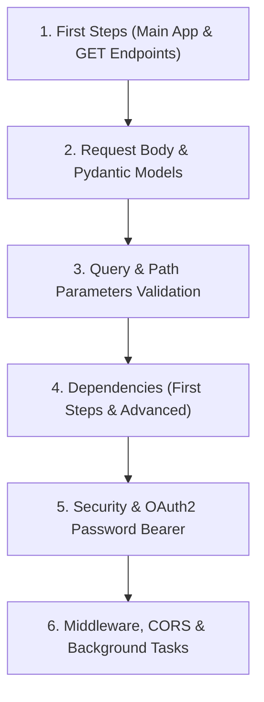

# Exercise Sixteen: Documentation Navigation for FastAPI Submission

## Overview
This document represents the complete submission for **Exercise 16 - Documentation Navigation for FastAPI**, building a personalized documentation reading roadmap, extracting deep-dive notes on complex features (Dependency Injection, Background Tasks, Security), translating abstract docs into code patterns, and creating a complete **Blog Platform REST API**.

---

## Part 1: Documentation Reading Roadmap & Key Sections

### 1. Recommended FastAPI Documentation Reading Order



### 2. Top 5 Most Important Documentation Sections

1. **[Tutorial - User Guide: First Steps](https://fastapi.tiangolo.com/tutorial/first-steps/)**: Essential app instantiation and routing decorators.
2. **[Request Body & Pydantic](https://fastapi.tiangolo.com/tutorial/body/)**: Core data validation, Field annotations, and JSON parsing.
3. **[Dependencies - First Steps](https://fastapi.tiangolo.com/tutorial/dependencies/)**: FastAPI’s built-in dependency injection system (`Depends`).
4. **[Security - First Steps with OAuth2](https://fastapi.tiangolo.com/tutorial/security/first-steps/)**: Standard authentication flows and password bearer tokens.
5. **[Bigger Applications - Multiple Files](https://fastapi.tiangolo.com/tutorial/bigger-applications/)**: Modularizing large codebases using `APIRouter`.

---

## Part 2: Documentation Deep Dive Notes

### 1. The `Depends()` Function
* **Purpose**: Declares code dependencies that FastAPI should execute before invoking a route handler.
* **When to use**: Database session management, JWT authentication, header verification, pagination parsing.
* **When NOT to use**: Pure utility functions with no request context or shared scope.

### 2. Background Tasks (`BackgroundTasks`)
* **Purpose**: Executes deferred functions *after* sending an HTTP response to the client.
* **Use Cases**: Sending welcome emails, audit logging, pushing telemetry metrics.

---

## Part 3: Concept to Code Translation Reference Guide

```python
from fastapi import FastAPI, Depends, HTTPException, Header, Path, Query, Cookie, BackgroundTasks, status
from pydantic import BaseModel, Field, EmailStr
from typing import Optional, List

app = FastAPI(title="Documentation Reference Patterns")

# ----------------------------------------------------
# Pattern 1: Dependency Injection with Header Verification
# ----------------------------------------------------
async def verify_api_key(x_api_key: str = Header(...)):
    if x_api_key != "valid_key_123":
        raise HTTPException(status_code=403, detail="Invalid API key")
    return x_api_key

async def get_current_user(api_key: str = Depends(verify_api_key)):
    return {"user_id": 101, "name": "Alice Developer"}

@app.get("/profile/")
async def read_profile(user: dict = Depends(get_current_user)):
    return {"message": f"Hello, {user['name']}!", "subscription": "premium"}

# ----------------------------------------------------
# Pattern 2: Pydantic Schema Filtering (Request vs Response)
# ----------------------------------------------------
class UserCreate(BaseModel):
    username: str = Field(..., min_length=3, max_length=50)
    email: EmailStr
    password: str = Field(..., min_length=8)

class UserResponse(BaseModel):
    id: int
    username: str
    email: EmailStr

@app.post("/users/", response_model=UserResponse, status_code=status.HTTP_201_CREATED)
async def create_user(user: UserCreate):
    created_user = user.dict()
    created_user["id"] = 1001
    return created_user  # Password automatically filtered out by response_model

# ----------------------------------------------------
# Pattern 3: Async Background Tasks
# ----------------------------------------------------
def send_welcome_email(user_email: str):
    print(f"Sending background welcome email to {user_email}...")

@app.post("/register/")
async def register(user: UserCreate, background_tasks: BackgroundTasks):
    background_tasks.add_task(send_welcome_email, user.email)
    return {"message": "Registration successful. Welcome email queued."}
```

---

## Part 4: Complete Blog Platform REST API Challenge

Below is the complete implementation of a RESTful Blog API combining User Auth, Post CRUD, Commenting, Search, and Background Tasks based strictly on FastAPI official documentation patterns:

```python
"""
FastAPI Full-Featured Blog Platform API
Features: User Auth (OAuth2 JWT), Post CRUD, Comments, Search, Background Tasks
"""

from datetime import datetime, timedelta
from typing import Optional, List, Dict
from fastapi import FastAPI, APIRouter, Depends, HTTPException, status, Query, Path, BackgroundTasks
from fastapi.security import OAuth2PasswordBearer, OAuth2PasswordRequestForm
from jose import JWTError, jwt
from passlib.context import CryptContext
from pydantic import BaseModel, Field, EmailStr

# ==========================================
# 1. SECURITY & CONFIGURATIONS
# ==========================================

SECRET_KEY = "blog-secret-key-change-in-production"
ALGORITHM = "HS256"
ACCESS_TOKEN_EXPIRE_MINUTES = 60

pwd_context = CryptContext(schemes=["bcrypt"], deprecated="auto")
oauth2_scheme = OAuth2PasswordBearer(tokenUrl="auth/login")

# In-memory storage
users_db: Dict[str, Dict] = {}
posts_db: Dict[int, Dict] = {}
comments_db: Dict[int, List[Dict]] = {}

post_id_counter = 0
comment_id_counter = 0

# ==========================================
# 2. SCHEMAS
# ==========================================

class Token(BaseModel):
    access_token: str
    token_type: str

class UserRegister(BaseModel):
    username: str = Field(..., min_length=3, max_length=30)
    email: EmailStr
    password: str = Field(..., min_length=6)

class UserOut(BaseModel):
    username: str
    email: EmailStr

class PostCreate(BaseModel):
    title: str = Field(..., min_length=3, max_length=150)
    content: str = Field(..., min_length=10)
    tags: List[str] = Field(default=[])

class PostOut(BaseModel):
    id: int
    title: str
    content: str
    author: str
    tags: List[str]
    created_at: datetime

class CommentCreate(BaseModel):
    text: str = Field(..., min_length=1, max_length=500)

class CommentOut(BaseModel):
    id: int
    post_id: int
    author: str
    text: str
    created_at: datetime

# ==========================================
# 3. HELPER & DEPENDENCY FUNCTIONS
# ==========================================

def get_password_hash(password: str) -> str:
    return pwd_context.hash(password)

def verify_password(plain_password: str, hashed_password: str) -> bool:
    return pwd_context.verify(plain_password, hashed_password)

def create_access_token(data: dict) -> str:
    to_encode = data.copy()
    expire = datetime.utcnow() + timedelta(minutes=ACCESS_TOKEN_EXPIRE_MINUTES)
    to_encode.update({"exp": expire})
    return jwt.encode(to_encode, SECRET_KEY, algorithm=ALGORITHM)

async def get_current_user(token: str = Depends(oauth2_scheme)) -> UserOut:
    credentials_exception = HTTPException(
        status_code=status.HTTP_401_UNAUTHORIZED,
        detail="Could not validate credentials",
        headers={"WWW-Authenticate": "Bearer"},
    )
    try:
        payload = jwt.decode(token, SECRET_KEY, algorithms=[ALGORITHM])
        username: str = payload.get("sub")
        if username is None or username not in users_db:
            raise credentials_exception
    except JWTError:
        raise credentials_exception

    user_data = users_db[username]
    return UserOut(username=user_data["username"], email=user_data["email"])

def notify_post_author(author_email: str, comment_text: str):
    """Background task to simulate email notification on new comment."""
    print(f"[BACKGROUND TASK] Sending email to {author_email}: New comment '{comment_text[:20]}...'")

# ==========================================
# 4. ROUTE HANDLERS
# ==========================================

app = FastAPI(
    title="FastAPI Blog Platform API",
    description="Full Blog API following FastAPI official documentation guidelines",
    version="1.0.0"
)

# --- AUTH ROUTES ---
@app.post("/auth/register", response_model=UserOut, status_code=status.HTTP_201_CREATED, tags=["Auth"])
async def register(user: UserRegister):
    if user.username in users_db:
        raise HTTPException(status_code=400, detail="Username already registered")
    
    users_db[user.username] = {
        "username": user.username,
        "email": user.email,
        "hashed_password": get_password_hash(user.password)
    }
    return users_db[user.username]

@app.post("/auth/login", response_model=Token, tags=["Auth"])
async def login(form_data: OAuth2PasswordRequestForm = Depends()):
    user = users_db.get(form_data.username)
    if not user or not verify_password(form_data.password, user["hashed_password"]):
        raise HTTPException(status_code=401, detail="Invalid username or password")
    
    access_token = create_access_token(data={"sub": user["username"]})
    return {"access_token": access_token, "token_type": "bearer"}

# --- BLOG POSTS CRUD ---
@app.post("/posts/", response_model=PostOut, status_code=status.HTTP_201_CREATED, tags=["Posts"])
async def create_post(post: PostCreate, current_user: UserOut = Depends(get_current_user)):
    global post_id_counter
    post_id_counter += 1

    new_post = {
        "id": post_id_counter,
        "title": post.title,
        "content": post.content,
        "author": current_user.username,
        "tags": post.tags,
        "created_at": datetime.utcnow()
    }
    posts_db[post_id_counter] = new_post
    comments_db[post_id_counter] = []
    return new_post

@app.get("/posts/", response_model=List[PostOut], tags=["Posts"])
async def list_posts(
    skip: int = Query(0, ge=0),
    limit: int = Query(10, ge=1, le=50)
):
    posts = list(posts_db.values())
    return posts[skip:skip + limit]

@app.get("/posts/search/", response_model=List[PostOut], tags=["Posts"])
async def search_posts(q: str = Query(..., min_length=2, description="Search query")):
    """Search posts by title or content snippet."""
    results = [
        p for p in posts_db.values()
        if q.lower() in p["title"].lower() or q.lower() in p["content"].lower()
    ]
    return results

@app.get("/posts/{post_id}", response_model=PostOut, tags=["Posts"])
async def get_post(post_id: int = Path(..., gt=0)):
    if post_id not in posts_db:
        raise HTTPException(status_code=404, detail="Blog post not found")
    return posts_db[post_id]

# --- COMMENTS & BACKGROUND TASKS ---
@app.post("/posts/{post_id}/comments/", response_model=CommentOut, status_code=status.HTTP_201_CREATED, tags=["Comments"])
async def add_comment(
    post_id: int,
    comment: CommentCreate,
    background_tasks: BackgroundTasks,
    current_user: UserOut = Depends(get_current_user)
):
    if post_id not in posts_db:
        raise HTTPException(status_code=404, detail="Blog post not found")

    global comment_id_counter
    comment_id_counter += 1

    new_comment = {
        "id": comment_id_counter,
        "post_id": post_id,
        "author": current_user.username,
        "text": comment.text,
        "created_at": datetime.utcnow()
    }
    comments_db[post_id].append(new_comment)

    # Trigger background email notification to author
    author_username = posts_db[post_id]["author"]
    author_email = users_db[author_username]["email"]
    background_tasks.add_task(notify_post_author, author_email, comment.text)

    return new_comment

@app.get("/posts/{post_id}/comments/", response_model=List[CommentOut], tags=["Comments"])
async def get_comments(post_id: int = Path(..., gt=0)):
    if post_id not in posts_db:
        raise HTTPException(status_code=404, detail="Blog post not found")
    return comments_db.get(post_id, [])
```

---

## Reflection & Key Learnings

1. **Documentation Ergonomics**: FastAPI's documentation provides executable code snippets for every feature, making translation into working APIs fast and direct.
2. **Integrated Security Standard**: Following the official [Security Guide](https://fastapi.tiangolo.com/tutorial/security/) simplifies JWT authorization via `OAuth2PasswordBearer` and `Depends(get_current_user)`.
3. **Seamless Async Operations**: Combining `BackgroundTasks` with response handlers keeps response times low without setting up heavy Celery infrastructure.
